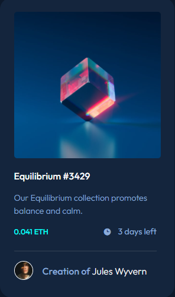

# Frontend Mentor - NFT preview card component solution

This is a solution to the [NFT preview card component challenge on Frontend Mentor](https://www.frontendmentor.io/challenges/nft-preview-card-component-SbdUL_w0U). Frontend Mentor challenges help you improve your coding skills by building realistic projects. 

## Table of contents

- [Overview](#overview)
  - [The challenge](#the-challenge)
  - [Screenshot](#screenshot)
  - [Links](#links)
- [My process](#my-process)
  - [Built with](#built-with)
  - [What I learned](#what-i-learned)
  - [Continued development](#continued-development)
  - [Useful resources](#useful-resources)
- [Author](#author)
- [Acknowledgments](#acknowledgments)

**Note: Delete this note and update the table of contents based on what sections you keep.**

## Overview

### The challenge

Users should be able to:

- View the optimal layout depending on their device's screen size
- See hover states for interactive elements

### Screenshot




### Links

- Solution URL: [Check out the code](https://github.com/TheCoderGuru/nft-preview-card-component)
- Live Site URL: [Visit the live site](https://nft-preview-card-component-teal.vercel.app/)

## My process

### Built with

- Semantic HTML5 markup
- CSS custom properties
- Flexbox
- CSS Grid


### What I learned

This challenge reiterated the concept of positioning items to the top of a container using ```position: absolute; top: 0;``` on the respective image and then ```position: relative``` on the container that you would like the image to be relative to.


### Continued development

I plan to keep using css variables and css pseudoelements as much as possible in order to gain more familiarity in addition to its usage and good practices when using it.

### Useful resources

- [MDN CSS Reference](https://developer.mozilla.org/en-US/docs/Web/CSS) - This is the guide to all the css properties with an indept explanation. Definitely recommend it.


## Author

- Frontend Mentor - [@TheCoderGuru](https://www.frontendmentor.io/profile/TheCoderGuru)
- Twitter - [@TheCoderGuru](https://www.twitter.com/TheCoderGuru)


## Acknowledgments

I would like to acknowledge my friend in code [Mariem Bchir](https://github.com/Mabchir) from the Frontend Mentor community for her helpful feedback given to me on this solution.

Check out her [profile](https://www.frontendmentor.io/profile/Mabchir) on Frontend Mentor and her [Github](https://www.github.com/Mabchir)